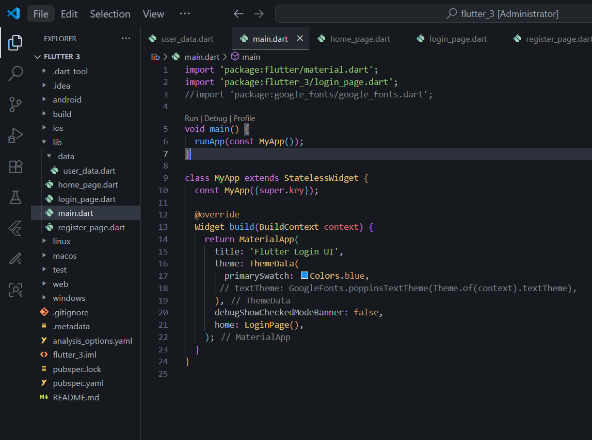
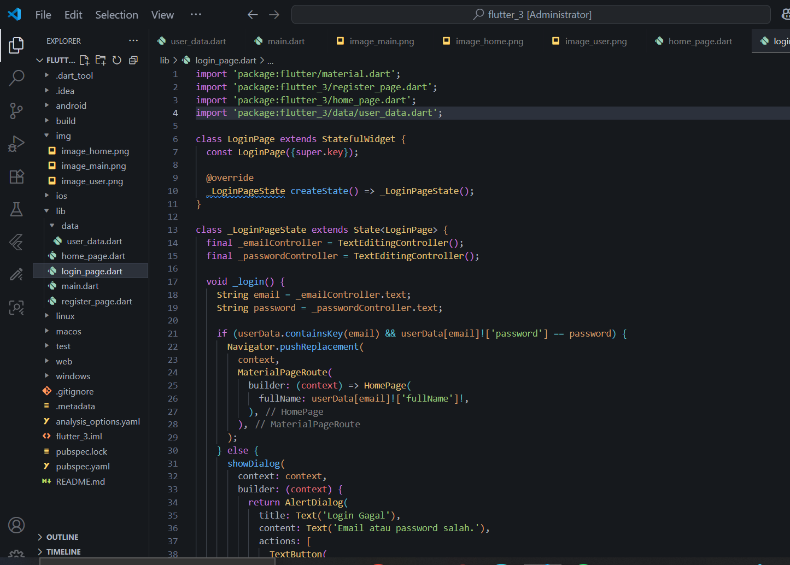
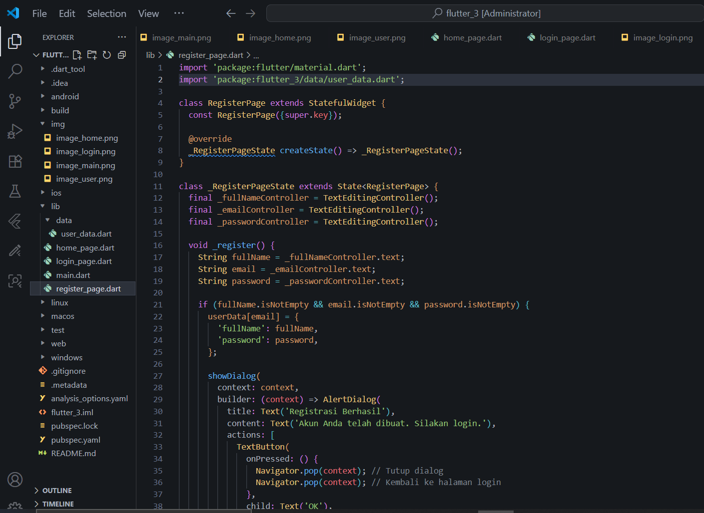
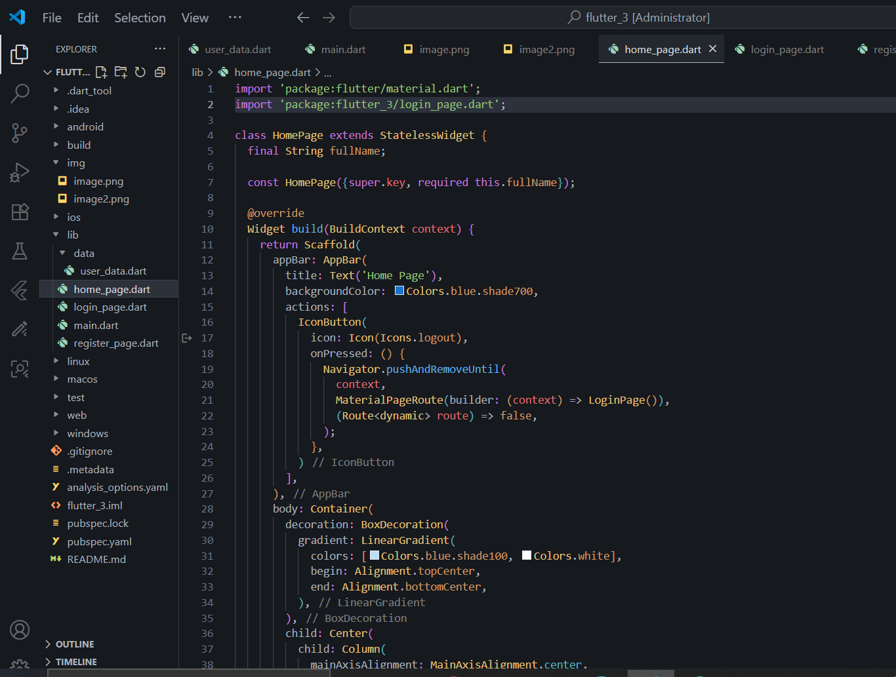
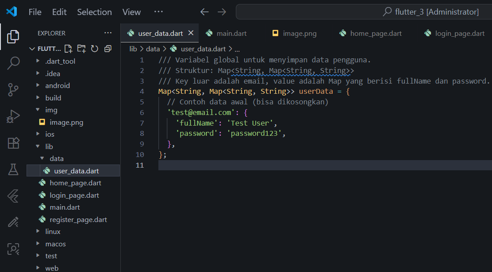
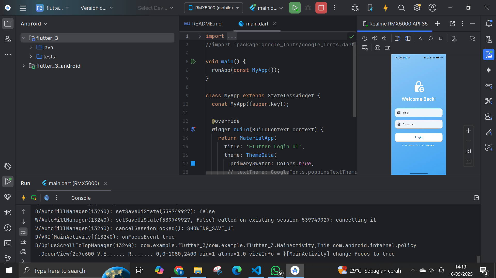
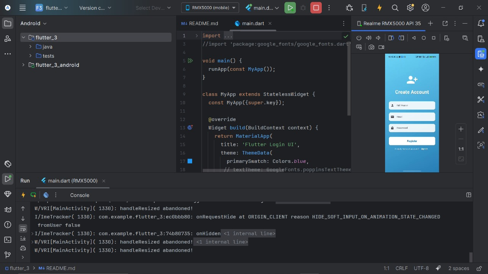
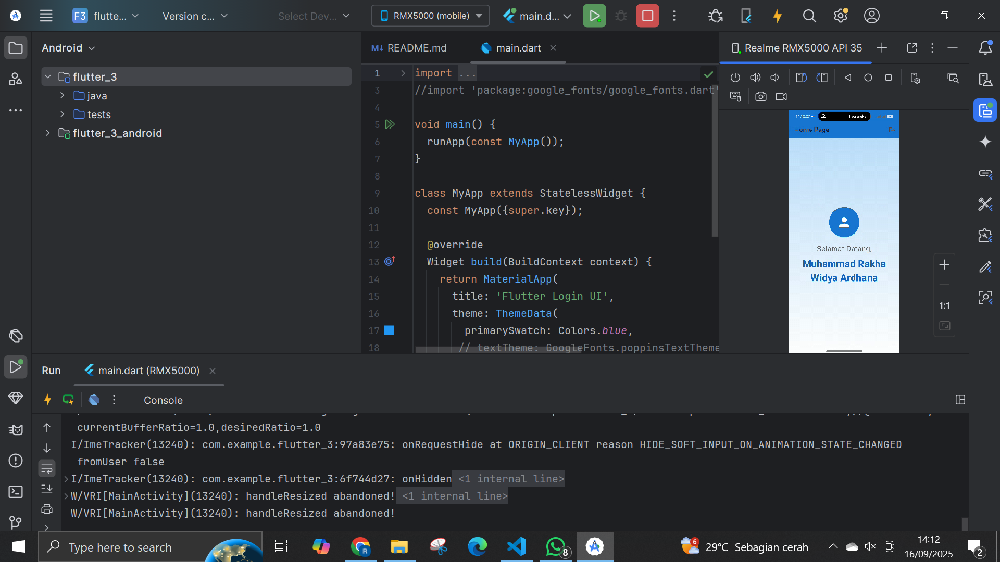

    1. TUJUAN PEMBELAJARAN
- Merancang dan membuat layout halaman Login dan Registrasi.
- Menggunakan widget dasar Flutter seperti Scaffold, Column, TextField, dan ElevatedButton.
- Mengimplementasikan navigasi antar halaman menggunakan Navigator.
- Mengelola state sederhana dan menyimpan data input pengguna.
- Memahami event handling seperti aksi tombol login/registrasi.

    2. ALAT YANG DIBUTUHKAN
- Flutter SDK
- Android Studio / VS Code (dengan ekstensi Flutter)
- Emulator Android/iOS atau perangkat fisik

    3. ANALISIS PROGRAM
- main.dart
    titik awal aplikasi dan untuk mengatur halaman login awal(homepage)
    

- login_page.dart
    berisi form login dengan input email dan password, jika data cocok dengan user akan diarahkan ke homepage, jika salah muncul gagal login
    

- register_page.dart
    berisi form untuk registrasi dengan memasukkan nama lengkap, email dan passowrd, data pengguna akan disimpan keuser, jika sukses maka akan muncul alert sukses dan kembali ke halaman login
    

- home_page.dart
    halaman utama setelah login dengan akun yang sudah diregistrasikan, lalu menampilkan pesan selamat datang dengan nama pengguna yg telah dimasukkan tadi, kalu ada tombol logout untuk kembali ke halaman login
    

- user_data.dart
    disini untuk menyimpan data akun yang sudah ditregistrasikan menggunakan map
    

    4. OUTPUT PROGRAM
- halaman login
    
- halaman registrasi
    
- halaman home
    

    5. LATIHAN"# pembuatan-form-login-dan-registrasi-interaktif" 
